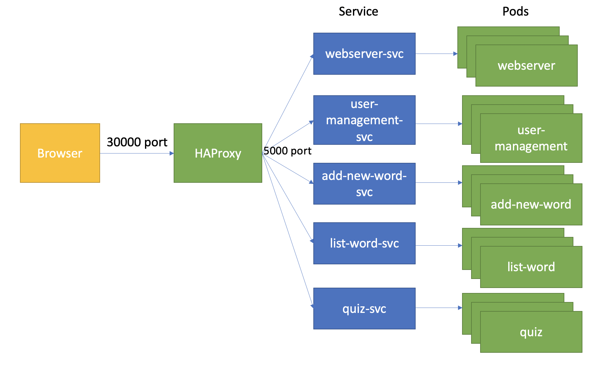

# WordQuizServer
This program is based on Python flask and sqlite. Python flask is used as an interface about sqlite manipulation. And sqlite help us to store accounts and japanese words information. 
The server is splited into 5 py files(images): WebServer.py(webserver), UserManagement.py(user-management), AddNewWord.py(add-new-word), ListWord.py(list-word), Quiz.py(quiz).
You can follow these steps(scripts) to build the images:
1. python38/buildImage.sh or .bat
2. WebServer/buildImage.sh or .bat
3. UserManagement/buildImage.sh or .bat
4. AddNewWord/buildImage.sh or .bat
5. ListWord/buildImage.sh or .bat
6. Quiz/buildImage.sh or .bat

Before you start containers, you have to put db into volume. You can use DB/putDBIntoVolume.sh to do so.
Once these images are built and db volume is prepared, you can use startAllContainer.sh or .bat to start all of them.
To prevent cors, I implemented haproxy image to proxy the connection to backends.
Before you build haproxy image, you have to start above containers and use "docker inspect network bridge" to find each container ip in docker bridge network.
Then modify HAProxy/local/haproxy.cfg to make sure each backends are redirected to correct container ip.
Once you modified HAProxy/local/haproxy.cfg, you can use HAProxy/local/buildImage.sh and startContainer.sh to start HAProxy.
Finally you can access the website on your browser: https://localhost:30000/loginLobby


To deploy images onto kubenetes cluster, following steps takes GCP as example:
1. Create cluster/project on GCP.
2. Instead use DB/putDBIntoVolume, you have to prepare a persistent volume with ReadWriteMany mode on GCP. To do so, we have to setup a nfs server for pv and pvc. I follow this guide to do so and put ymal at DB/nfs. [Guide](https://medium.com/@Sushil_Kumar/readwritemany-persistent-volumes-in-google-kubernetes-engine-a0b93e203180)
3. Modify pushImage.sh scripts to point to your project's image registry and use this to push images onto GCP. For more information, see the image registry document of GCP.
4. Once pv/pvc is prepared, we can use image and job at DB/buildImage.sh, DB/pushImage.sh and DB/db-job.yaml to put db into persistent volume.
5. Once images are pushed onto GCP, you can use (servers)/k8s/\*.yaml to create deployment and service on GCP.
6. After pod and services are prepared, you can check the cluster ip of each service and apply them into HAProxy/haproxy.cfg and build haproxy image and push it onto GCP.
7. Create deployment and service for haproxy.

You can access my current website on GCP: https://35.189.171.185:30000/loginLobby 
The test account : test///123




```
The following lists HTTP POST request(server model) description:
1. path : "/login": 
        required json request tags : ["username","password"]
        return json {"status":string,"serialNum":string,"identifier":string}
    'serialNum' and 'identifier' are needed for other POST request like: addWord, deleteWord ... etc. 
2. path : "/register":
        required json request tags : ["username","password"]
        return json {"status":string}
    This function will generate table for storing words and sources, then record account infomation.
3. path : "/addSoruce":
        required json request tags : ["username","source","serialNum", "identifier"]
        return json {"status":string , "lastId":int}
    'lastId' is the id of source which you added by this request.
4. path : "/listSoruce":
        required json request tags : ["username","serialNum", "identifier"]
        return json {"status":string , "sources":jsonobject}
    'sources' stored a list of pairs that is formatted as {id:sourceName}.
5. path : "/deleteWord":
        required json request tags : ["username","serialNum", "identifier","wordId"]
        return json {"status":string}
    if delete failed, will return error msg.
6. path : "/addWord":
        required json request tags : ["username","serialNum", "identifier"] and ['word','reading','meaning','sourceId','page','sentence']
        return json {"status":string}
    ['word','reading','meaning','sourceId','page','sentence'] is the word information that will be added to database by this request.
7. path : "/searchWordByWordAndReading":
        required json request tags : ["username","serialNum", "identifier"] and ["word"]
        return json {"status":string,"words":jsonArray}
    'words' is a list of jsonObject contains wordInfo. It refers to the function generateJsonWord().
8. path : "/randomWord":
        required json request tags : ["username","serialNum", "identifier"] and ["num"]
        return json {"status":string,"words":jsonArray}
    'words' is a random picked list of jsonObject contains wordInfo. The size of 'words' is determined by 'num'.
9. path : "/recordAnswerResult":
        required json request tags :["username","serialNum", "identifier"] and ["wordId","result"]
        return json {"status":string}
    "result" is an integer for that 1 is correct, 0 is incorrect. Then accumulate to database.
10. path : "/listAllReadingByWord":
        required json request tags :["username","serialNum","identifier"] and ["word"]
        return json {"status":string,"readingList":jsonArray}
        readingList is a reading list from network dictionary goo. 
11. path : "/listAllMeaningByWord":
        required json request tags :["username","serialNum","identifier"] and ["word"]
        return json {"status":string,"meaningList":jsonArray}
        meaningList is a meaning list from network dictionary goo. 
        


The following lists HTTP GET request(web page view) description:
1. path: '/loginLobby' return loginLobby.html
    In loginLobby.html, when logging succeed, jump to '/home' for word functions.
2. path: '/home' return home.html
    home.html have 3 sub pages about word functions below.
3. path: '/addNewWordPage' return addNewWordPage.html
4. path: '/searchWordPage' return searchWordPage.html
5. path: '/wordQuizPage' return wordQuizPage.html
All the html file you can find them in /templates.
The js file stored in /static.
```
